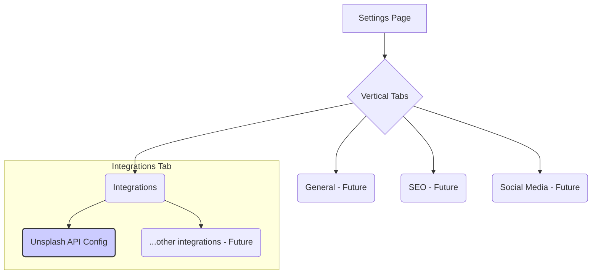

# CMS Admin Settings Section Design

## Introduction

This document outlines the design and structure for the new "Settings" section within the CMS admin dashboard. The primary goal is to provide a centralized location for various site and integration configurations. The design emphasizes modularity and extensibility to easily accommodate future settings categories.

## Overall Layout

The Settings section utilizes a **vertical tab navigation** structure located on the left side of the page. This allows for clear separation between different configuration areas and provides a scalable way to add new categories in the future.

## Settings Categories

### Integrations

This category houses settings related to third-party services and APIs.

#### Unsplash API Configuration

*   **Purpose:** Configure credentials for the Unsplash API. This enables users to search for images directly within the CMS and add them as featured images to posts, including proper attribution.
*   **Fields:**

    | Label                  | Key/Variable Name      | Data Type      | Required | Description                                  | Security Notes                             |
    | ---------------------- | ---------------------- | -------------- | -------- | -------------------------------------------- | ------------------------------------------ |
    | Access Key             | `unsplash_access_key`  | `String`       | Yes      | Your Unsplash application Access Key.        | Masked input, Encrypted storage            |
    | Secret Key             | `unsplash_secret_key`  | `String`       | Yes      | Your Unsplash application Secret Key.        | Masked input, Encrypted storage            |
    | Application Name       | `unsplash_app_name`    | `String`       | No       | Optional name for identification purposes. | Plain text storage                         |

*   **Functionality:**
    *   **Test Connection Button:** Allows users to verify that the entered (or saved) API keys are valid by making a test request to the Unsplash API. Provides immediate visual feedback (success/error).
    *   **Save Settings Button:** Persists the entered configuration values securely.

## Backend Storage

Settings are stored securely in the application's database, likely using a dedicated `Setting` model (managed via Prisma). Sensitive information, such as API keys (`unsplash_access_key`, `unsplash_secret_key`), is encrypted before being saved to the database and decrypted only when necessary for backend operations (e.g., making API calls to Unsplash).

## Post Editor Integration

The configured Unsplash API keys enable the following workflow within the post editor:

1.  A button, such as "Add from Unsplash", is available in the "Featured Image" section.
2.  Clicking this button opens a modal dialog.
3.  The modal provides an interface to search the Unsplash library.
4.  Users can select an image from the search results.
5.  Upon selection, the modal closes, and the chosen image's URL is automatically set as the post's featured image. Importantly, the required attribution data (photographer's name and profile link) is also retrieved and stored with the post.

## Future Settings Categories

This section serves as a placeholder for future development. Potential categories include:

*   **General:** Site title, tagline, admin email, timezone, etc.
*   **SEO:** Default meta descriptions, social sharing image defaults, analytics tracking codes.
*   **Social Media:** Links to social media profiles.
*   **Users & Permissions:** (If applicable) User role management.